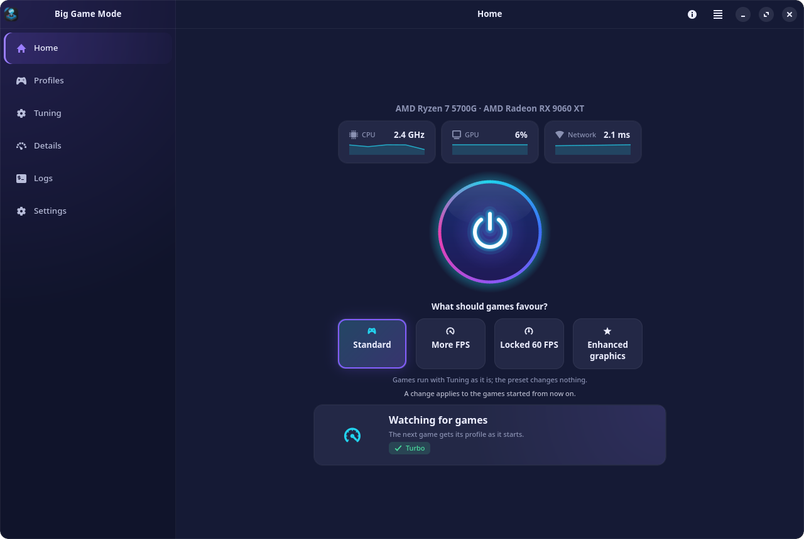
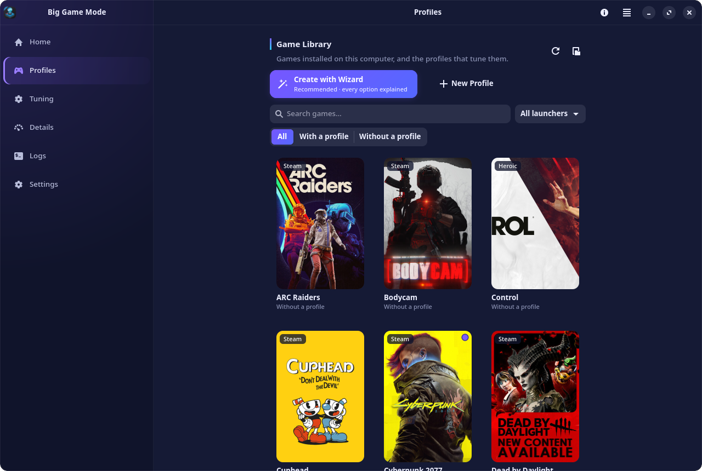
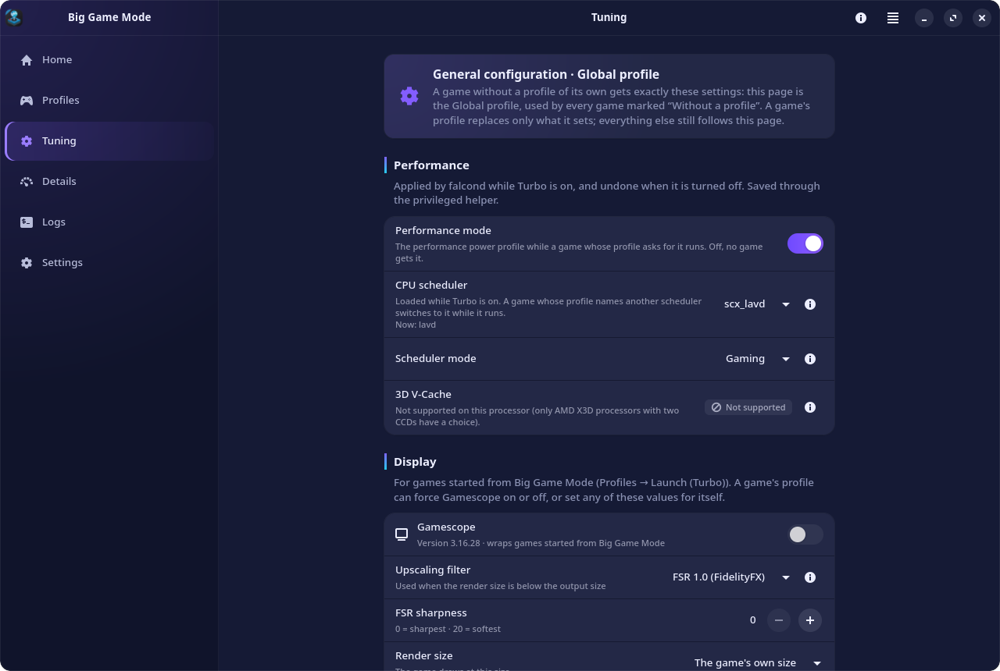
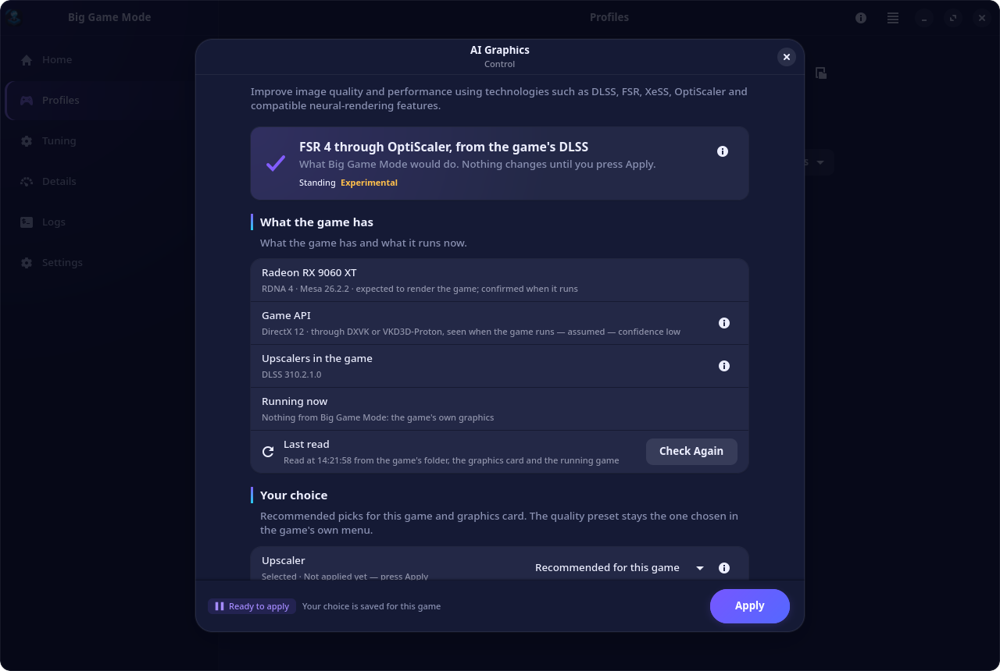
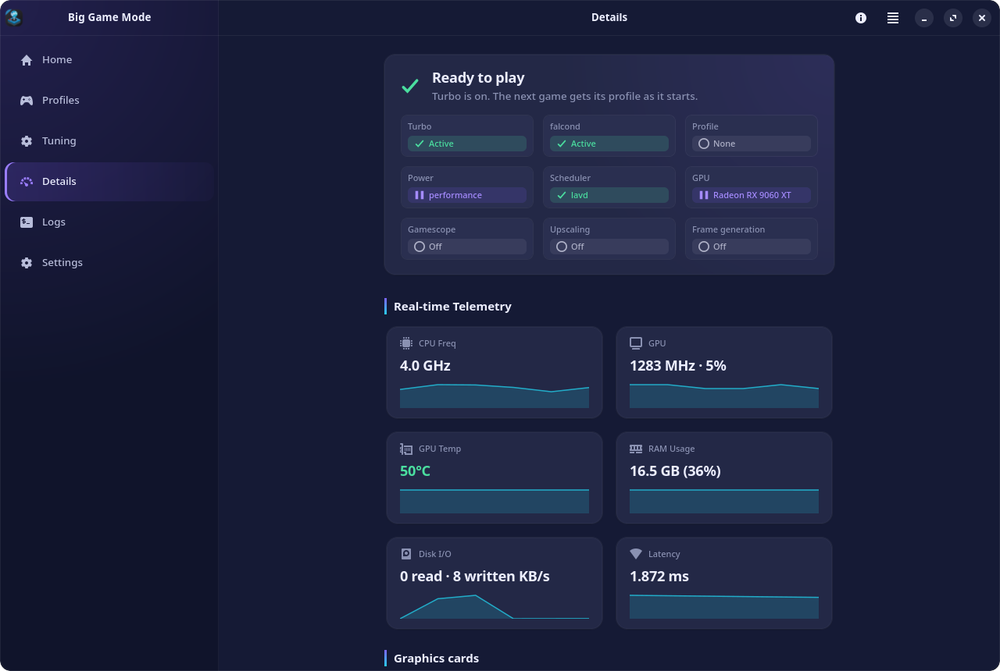
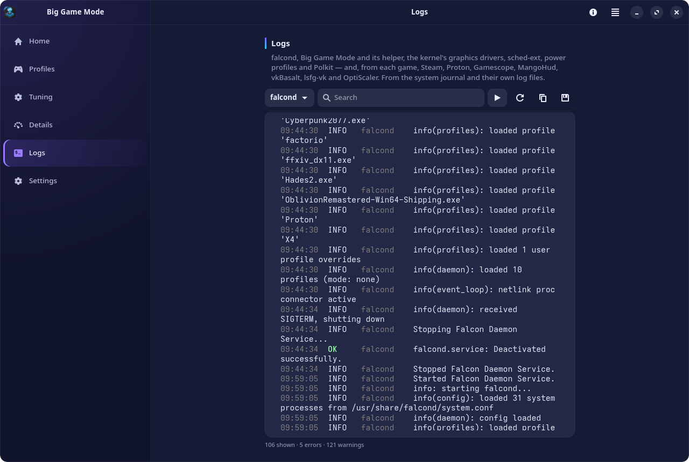
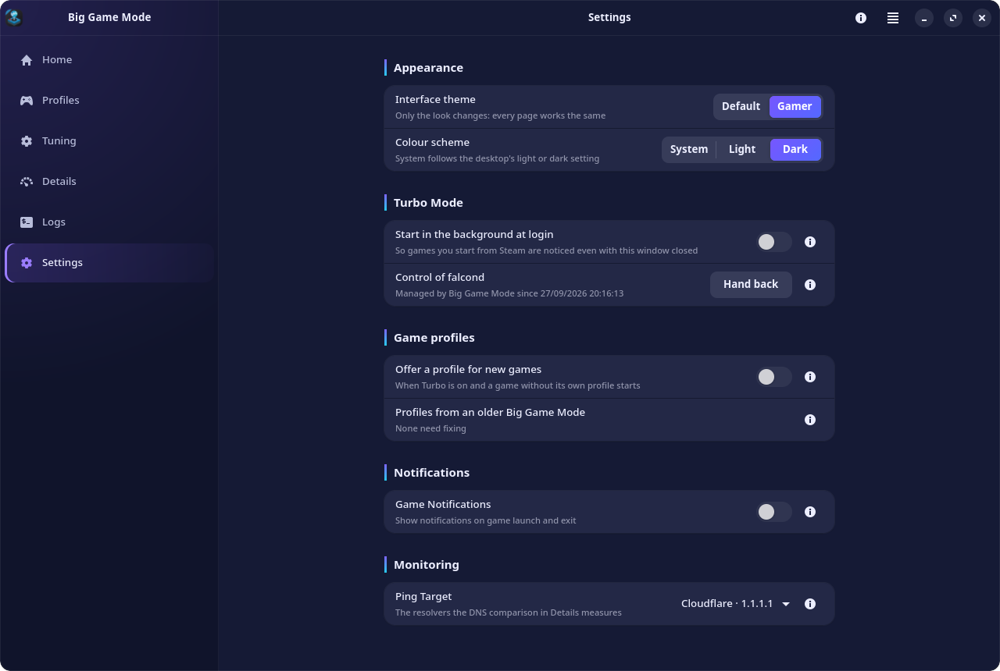
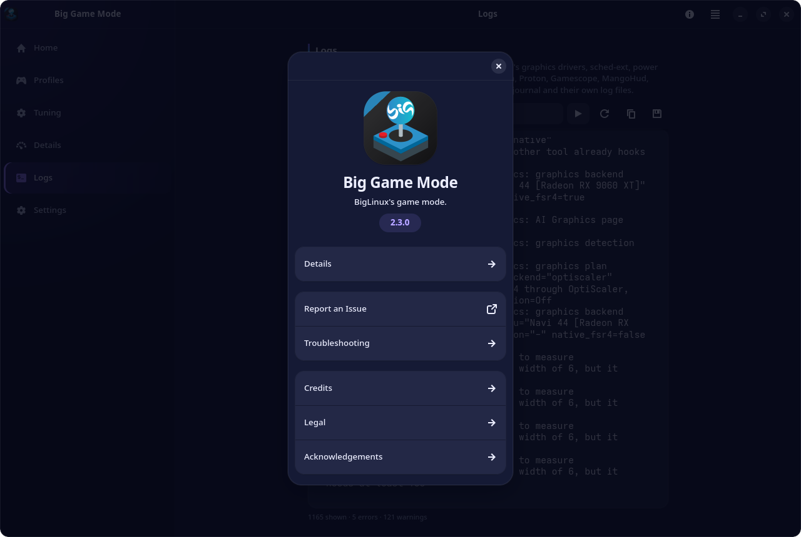

<div align="center">


# Big Game Mode

**BigLinux's game mode.**<br>
One switch for per-game performance, presets for what games should favour,
AI Graphics with full backup and undo, and a page that shows — with evidence —
what is really in effect.

[](https://github.com/biglinux/bigamemode/releases)
[](LICENSE)
[](https://www.rust-lang.org/)
[](https://gnome.pages.gitlab.gnome.org/libadwaita/)
[](#languages)

[Features](#features) ·
[Screenshots](#screenshots) ·
[Installation](#installation) ·
[Troubleshooting](#troubleshooting) ·
[Security](#security) ·
[Development](#development)

<br>

<picture>
  <source media="(prefers-color-scheme: light)" srcset="docs/screenshots/home-light.png">
  
</picture>

</div>

---

## What it is

Big Game Mode (the BiGame-mode project) is the gaming hub of BigLinux. With one
button, **Turbo**, every game gets its own performance profile, applied by
[falcond](https://git.pika-os.com/general-packages/falcond) when the game
starts and undone when it closes. The application shows what is really in
effect, measures whether a change helped, and takes care of what happens
*inside* the game — upscaling and frame generation — always with a backup and
a way back.

> [!NOTE]
> One rule runs through the project: **nothing is offered that the machine
> cannot do, and nothing is called an improvement without a measurement.**

## What's new in 2.3.0

- **Big Game Mode** is the name you see everywhere; package names, the
  application id and file locations are unchanged.
- **The tray is a quick control:** Turbo on or off, the four presets, and its
  own symbolic icon drawn in the panel's colours.
- **Launchers opened before a preset** (Steam, Heroic, Lutris) are offered a
  reopen from a notice at the top of any page, never while one of their games
  runs.
- **Profiles:** the wizard is the main way to create one, and a profile can be
  started from its editor with **Launch (Turbo)**. Home names the CPU and every
  GPU, the gaming one first on hybrid laptops.
- **lsfg-vk 2.x:** its configuration format is read from the installed
  library and written in that format; a `Lossless.dll` lsfg-vk cannot use is
  reported instead of letting the game fail.
- **Hybrid NVIDIA laptops:** Gamescope no longer crashes (the render-offload
  variables reach only the game), and nested Gamescope shows the game the
  screen's size instead of 1280×720.
- **Turbo** rolls back cleanly when falcond fails to start, and a preset leaves
  nothing behind once Turbo is off. Restore Defaults now resets everything
  Tuning shows.
- **Game detection** reads Steam, Heroic and Lutris libraries directly and no
  longer takes launchers, trials, bootstrappers or scripts for the game.
- **AI Graphics:** frame generation is shown active only when OptiScaler's log
  proves it; Restore and Repair are safer; the download cache keeps only the
  releases games use; a game's built-in FSR under VKD3D-Proton stays its own.
- **A stricter privileged helper**, and about 0.15 % of one CPU core while idle
  in the tray (2 % before).
- **No extra repository needed:** falcond, lsfg-vk, sched-ext, Gamescope,
  MangoHud and vkBasalt are optional. What needs one says so and how to
  install it.

<details>
<summary><b>2.2.0 and 2.1.0</b></summary>

- **2.2.0:** a welcome screen, a rewritten About and Help; Tuning with
  Gamescope always in view and vkBasalt looks (CAS or the Nara Linux style);
  game profiles with the same rows as Tuning, reaching Steam and Heroic games;
  Launch (Turbo) through every launcher; a redesigned AI Graphics window;
  background programs can be closed or paused, a measured DNS applied with a
  backup, and falcond handed back and taken again.
- **2.1.0:** Turbo presets chosen before switching it on; a redrawn Home;
  Tuning, game profiles and the profile wizard on one model with every
  conflict asked; Gamescope and Wine FSR reach Steam games through their launch
  options; Details tells when falcond does not apply a game's profile, and why.

</details>

## Features

### Turbo and presets

Turbo is the master switch. Off, Big Game Mode leaves every game alone. On,
falcond applies each game's profile — power profile, sched-ext CPU scheduler,
3D V-Cache mode, idle inhibition — and restores everything when the game
closes.

Before switching it on, choose what games should favour:

| Preset | What it does |
|---|---|
| **Standard** | Tuning as it is; the preset changes nothing |
| **More FPS** | No frame cap and no image filter; Wine FSR upscales a lower in-game resolution |
| **Locked 60 FPS** | DXVK and VKD3D-Proton's limiter in Proton games, MangoHud's in native games Big Game Mode starts |
| **Enhanced graphics** | vkBasalt CAS sharpening (from Big Game Mode's own CAS-only file), FSR 4 where the GPU has it, and 60 FPS so the heavier image stays steady |

A preset lives only in the running session (the user's systemd manager, never
`environment.d`) and leaves with Turbo, even when falcond stops on its own. Your
own `DXVK_CONFIG` and FSR 4 variables are kept and given back.

### Per-game profiles

Games from **Steam**, **Heroic**, **Lutris** and the application menu, native
or Flatpak — only the ones really installed. When an unknown game starts with
Turbo on, a notification offers to create its profile with a wizard that
explains every option. A profile has the same sections as Tuning, each option
starting at "General configuration". What a game needs reaches it where it can:
through **Launch (Turbo)**, Steam's launch options, or the game's settings in
Heroic — written with the launcher closed, touching only what Big Game Mode
added.

### Launch settings: Gamescope, MangoHud, vkBasalt, frame generation

**Tuning** holds the configuration every game shares:

- system performance through falcond (scheduler, V-Cache, profiles);
- **Gamescope** with sizes picked from standard resolutions and the main
  screen's;
- **Wine FSR** and **vkBasalt** (CAS or the Nara Linux look);
- **frame generation** with [lsfg-vk](https://github.com/PancakeTAS/lsfg-vk)
  (1.x and 2.x, with your own `Lossless.dll`, never shipped or downloaded);
- the **MangoHud** overlay, with Steam Deck–like styles.

Two technologies that do the same job never run in series: enabling one while
the other is on asks which to keep. What the machine cannot do is shown as
**Unsupported** or **Not installed**, with the command that fixes it — never as
a broken control.

### AI Graphics (OptiScaler)

AI Graphics analyses the game that really runs (following launcher stubs to
the real executable): its graphics API, the DLSS/XeSS/FSR it ships as a DLL or
builds into the executable, proxy DLLs, anti-cheat and the GPU it renders on.
It shows the verdict first, then why, and what to set in the game's own menu.
Only **Apply** changes anything. It installs
[OptiScaler](https://github.com/optiscaler/OptiScaler) from the official
release (HTTPS, pinned SHA-256) with a verified backup, or raises FSR 3.1 to
FSR 4 through Proton. **Check Again**, **Repair**, **Restore** and **Diagnose**
are always there. Games with anti-cheat are never touched.

### Details, monitoring and logs

**Details** says for every part whether it is **active**, **waiting**,
**configured but not detected**, **off**, **missing a dependency** or
**unsupported**, with the evidence and the fix. It adds live telemetry, a card
per GPU (load, clocks, VRAM, temperature, power, and which one renders the
game), the video pipeline, a ranked **Problems** list, the network with a DNS
comparison, background load, broken Steam launch options and a support report.
**Logs** gathers falcond, the helper, power-profiles-daemon, scx_loader,
Gamescope, GPU drivers, crashes and, from Steam games' output, Proton/Wine,
MangoHud, vkBasalt, lsfg-vk and OptiScaler, filtered by source.

### Measure the difference

Compares a game with and without optimisations over several alternated runs
and gives a verdict with Welch's t-test. A gain is called one only when it
exceeds the run-to-run spread. Method and results:
[docs/BENCHMARKS.md](docs/BENCHMARKS.md).

### Tray

Closing the window keeps Big Game Mode in the tray, with Turbo, the presets and
**Open** a click away. On GNOME the tray needs an AppIndicator extension.

## Screenshots

<table>
<tr>
<td width="50%"></td>
<td width="50%"></td>
</tr>
<tr>
<td align="center"><b>Profiles</b>: every installed game, each with its profile</td>
<td align="center"><b>Tuning</b>: what the machine cannot do is shown as such</td>
</tr>
<tr>
<td></td>
<td></td>
</tr>
<tr>
<td align="center"><b>AI Graphics</b>: the verdict first, then why</td>
<td align="center"><b>Details</b>: what is in effect, with the evidence</td>
</tr>
<tr>
<td></td>
<td></td>
</tr>
<tr>
<td align="center"><b>Logs</b>: every source, filtered</td>
<td align="center"><b>Settings</b>: Default and Gamer themes, light or dark</td>
</tr>
<tr>
<td colspan="2" align="center"></td>
</tr>
</table>

## Installation

### BigLinux, Manjaro and Arch Linux

Big Game Mode builds and installs from the official Arch repositories alone
(`core`, `extra`, `multilib`). No extra repository has to be added.

```bash
sudo pacman -S --needed base-devel git
git clone https://github.com/biglinux/bigamemode.git
cd bigamemode
makepkg -si
```

`makepkg` installs what the build needs, builds the tagged release, checks the
translation template, runs the tests and installs the package. Then open
**Big Game Mode** from the application menu.

### Requirements

| Package | Why |
|---|---|
| `gtk4`, `libadwaita`, `glib2`, `hicolor-icon-theme` | the interface |
| `dbus`, `polkit`, `systemd` | the privileged helper: a system-bus service started by systemd, every method authorised by Polkit |
| `curl`, `libarchive` | downloading and unpacking OptiScaler (AI Graphics) |
| `hwdata` | graphics card names |
| `iputils`, `iproute2` | network latency and queue discipline (Details) |

### Optional components

Each one unlocks features; without it the feature says it is unavailable and
how to install it.

| Package | Unlocks | Where it comes from |
|---|---|---|
| `falcond` | per-game performance profiles (without it Turbo applies only the general settings and presets) | BigLinux repository |
| `power-profiles-daemon` | the power profile games run with (falcond asks for it) | `extra` |
| `scx-scheds`, `scx-tools` | the sched-ext CPU schedulers falcond switches to per game | `extra` |
| `gamescope` | Gamescope per game and in presets | `extra` |
| `mangohud`, `lib32-mangohud` | the overlay, its frame cap, and *Measure the difference* (32-bit games need the `lib32` one) | `extra`, `multilib` |
| `vkbasalt` | CAS sharpening and the Nara Linux look | BigLinux repository |
| `lsfg-vk` | frame generation with your own `Lossless.dll` | BigLinux repository |
| `nvidia-utils` | GPU telemetry on NVIDIA cards (NVML) | `extra` |
| `networkmanager` | applying a DNS server from the DNS comparison | `extra` |
| `ntsync-autoload` | loading the NTSync driver at boot for Proton/Wine | `extra` |

On BigLinux every optional component above is in the distribution's own
repositories; on Arch, the three marked "BigLinux repository" come from the
AUR. The launchers themselves (Steam, Heroic, Lutris) are not dependencies:
Big Game Mode finds the ones installed, native or Flatpak.

The package installs `bigame-ui` (the application, run as your user),
`bigame-daemon` (the root helper) with its systemd unit, D-Bus files and Polkit
policy, the desktop entry, AppStream metadata, icons and translations.

> [!TIP]
> On upgrade the helper stops and comes back, new, at its next call. On
> removal falcond is handed back as it was before Big Game Mode took charge.
> Files AI Graphics placed in games stay until **Restore the game's graphics**; the
> backups are in `~/.local/state/bigame-mode/graphics`.

## Running

Open **Big Game Mode** from the menu, or run `bigame-ui`. `bigame-ui --background`
starts it in the tray; `bigame-ui --diagnostics` prints the support report in a
terminal without opening a window (`--network` adds the DNS measurements).

## Troubleshooting

| Symptom | What to do |
|---|---|
| Games get no performance profile | Install `falcond`: without it Turbo applies only the general settings. Details → Problems names anything else missing |
| A game does not get its profile | Details shows whether falcond applies it and why not; falcond 2.0.3 or newer is needed for games that rename their main thread (Cyberpunk 2077) |
| A preset does not reach Steam's games | Steam keeps the settings it was opened with: use **Reopen Steam** in the notice |
| A frame generation option is disabled | lsfg-vk is not installed or your `Lossless.dll` is not usable by it; the row says which |
| AI Graphics left a game broken | Profiles → the game's menu → **Restore the game's graphics**, or AI Graphics → **Repair** |
| No tray icon on GNOME | Install and enable an AppIndicator extension |
| Something else | Details → **Support report**, or `bigame-ui --diagnostics`, and the **Logs** page |

## How it works

- **falcond owns system performance.** It recognises a game by its process
  name, applies the profile and restores everything when the game closes. Big
  Game Mode switches falcond on and off (Turbo) and writes the profiles it reads.
- **Every setting has one owner.** Big Game Mode never applies itself what
  falcond or power-profiles-daemon already apply. Feral GameMode is not used:
  both would fight over the same settings.
- **A Steam game is started by Steam,** out of Big Game Mode's reach. What its
  profile asks for goes into the game's launch options, written with Steam
  closed, on every account; only the part Big Game Mode wrote is ever changed
  or removed.
- **AI Graphics detects what a game really uses** from the executable's import
  table, not DLL names, and records tested combinations that crash in its game
  list. Every install is a transaction: verified backup, journal, atomic swap
  and verification; an interrupted install is undone at the next start.
- Big Game Mode **never redistributes third-party binaries** and never downloads
  or replaces NVIDIA DLLs.

More in [docs/ARCHITECTURE.md](docs/ARCHITECTURE.md).

## Security

```text
┌─────────────────────────┐  D-Bus (system bus) ┌─────────────────────────┐
│ bigame-ui      (user)   │ ──────────────────▶ │ bigame-daemon   (root)  │
│ GTK4 + libadwaita, tray │   every call goes   │ validates every argu-   │
│ AI Graphics, measure-   │   through Polkit    │ ment; falcond profiles  │
│ ments, logs             │                     │ and config, Turbo, sysfs│
└───────────┬─────────────┘                     └───────────┬─────────────┘
            │ reads the state                               ▼
            └──────────────────────────────▶ falcond ──▶ scx_loader,
                                             (profiles)  power-profiles-daemon
```

- **The interface never runs as root.** Only a small helper on the system bus
  is privileged, confined by systemd (`ProtectSystem=strict`, `/sys` read-only
  except `/sys/devices`, one capability).
- **Every privileged method is authorised by Polkit first** (without Polkit,
  access is denied) and every argument is validated on the root side.
- **Narrow, atomic writes** to one known place each, never through a path the
  caller builds. Profiles cannot carry `start_script`/`stop_script`.
- **No command goes through a shell**; downloads are HTTPS-only with a pinned
  SHA-256 and a checked archive listing.

Details in [docs/SECURITY.md](docs/SECURITY.md).

## Compatibility

| | |
|---|---|
| **System** | BigLinux and other Arch/Manjaro systems with systemd. falcond 2.0.3 or newer is recommended |
| **Desktop** | Tested on KDE Plasma (Wayland); X11 sessions are supported but less tested |
| **Games** | Steam (including Proton), Heroic, Lutris and native games from the menu, native or Flatpak |
| **GPUs** | AMD, NVIDIA and Intel, including hybrid laptops (the GPU a game renders on is identified, with PRIME offload) |
| **Tested on** | Ryzen 7 5700G with Radeon RX 9060 XT (RDNA 4) and Radeon Vega; a hybrid laptop with Intel HD 630 and GeForce GTX 1050 Ti (NVIDIA 580); a virtual machine with a stock BigLinux |
| **Detected, not yet tested on real hardware** | RDNA 3, RTX, Intel Arc, hybrid CPUs, 3D V-Cache, laptops on battery, VRR and HDR. There, Big Game Mode offers only what it detects as supported |

## Benchmarks

Highlights (each a session of alternated runs with a Welch's t-test verdict):

| Measured | Result |
|---|---|
| Shadow of the Tomb Raider, 3440×1440, RX 9060 XT: OptiScaler FSR vs native TAA | **+10.1 %** (89.8 → 98.8 FPS); the game's own XeSS +4.9 % |
| Same game, GTX 1050 Ti laptop: OptiScaler FSR 3.1 vs the game's XeSS Quality | **+20.1 %** (24.2 → 29.0 FPS) |
| SuperTuxKart on the hybrid laptop: PRIME offload vs the integrated GPU | **4.7×** (13.0 → 61.2 FPS) |
| Locked 60 FPS preset, SuperTuxKart | 455 → 60 FPS, GPU power 53 → **31 W** |
| GPU DPM level pinned to `high` | 7.5–8.3 % **slower**, so Big Game Mode never forces it |
| Power profile, governor, sched-ext schedulers | no measurable change in GPU-bound games |

Method and every result: [docs/BENCHMARKS.md](docs/BENCHMARKS.md). Each
session's report and metrics are in `bigame-engine/benchmarks/`; the raw
captures are at the tag `benchmarks-raw-data`.

## Languages

Big Game Mode is written in English and translated into **29 languages**:
Bulgarian, Chinese, Croatian, Czech, Danish, Dutch, English, Estonian, Finnish,
French, German, Greek, Hebrew, Hungarian, Icelandic, Italian, Japanese, Korean,
Norwegian Bokmål, Polish, Portuguese, Brazilian Portuguese, Romanian, Russian,
Slovak, Spanish, Swedish, Turkish and Ukrainian. It follows the system
language. The catalogues are in [`locale/`](locale); corrections and new
languages are welcome.

## Development

Requires Rust 1.85 or newer, GTK 4.14+, libadwaita 1.7+,
`glib-compile-resources` (glib2) and, for the catalogues, gettext and Python 3.

```bash
cd bigame-engine
cargo build --workspace
cargo test --workspace
cargo clippy --workspace --all-targets --all-features -- -D warnings
./target/debug/bigame-ui
./target/debug/bigame-ui --diagnostics
```

| Crate | Role |
|---|---|
| `bigame-core` | all the logic, no interface: detection, profiles, Turbo, AI Graphics, telemetry, measurements |
| `bigame-ui` | the GTK4/libadwaita application and the tray icon |
| `bigame-daemon` | the root helper on D-Bus, authorised by Polkit |

- Without the package installed the interface runs, but what needs root
  (profiles, Turbo, falcond's configuration) is unavailable.
- `tests/daemon-authorization.sh` checks that the helper refuses every
  privileged method when Polkit is unreachable.
- `bigame-core/examples/` holds command-line tools: detection (`detect`,
  `library`, `running`, `health`), AI Graphics (`graphics_scan`,
  `graphics_plan`, `graphics_apply`, `graphics_status`,
  `graphics_capabilities`, `graphics_diagnose`, `graphics_native`), Turbo and
  Booster (`turbo`, `turbo_preset`, `booster_run`, `measure`), falcond control
  (`falcond_control`), the launch command (`launch_plan`), a game started
  through its launcher (`launch_through`), a game's settings in Heroic
  (`heroic_apply`), a game's Gamescope in Steam's launch options
  (`steam_gamescope`), the vkBasalt look (`vkbasalt_style`), lsfg-vk (`lsfg`)
  and benchmark reports (`bench_report`, `bench_native_report`). Run them with
  `cargo run -p bigame-core --example <name>`.

### Translations

Every visible text goes through `i18n`/`ni18n` in the interface and `N_` in
`bigame-core`. After changing texts:

```bash
python3 locale/extract-strings.py        # updates locale/bigame-mode.pot
for po in locale/*.po; do
    msgmerge -U --no-wrap --no-fuzzy-matching "$po" locale/bigame-mode.pot
done
```

The extractor refuses to run when a file with texts is missing from
`locale/POTFILES.in`, and the package build fails when the template is stale.
To try a translation from the build tree, compile the catalogues and point the
application at them:

```bash
for po in locale/*.po; do
    l=$(basename "$po" .po); mkdir -p /tmp/bgm-locale/$l/LC_MESSAGES
    msgfmt -o /tmp/bgm-locale/$l/LC_MESSAGES/bigame-mode.mo "$po"
done
BIGAME_LOCALEDIR=/tmp/bgm-locale LANGUAGE=pt_BR bigame-engine/target/debug/bigame-ui
```

### Packaging

The `PKGBUILD` builds the tag `v${pkgver}` from GitHub with
`cargo build --release --frozen --workspace` (LTO), checks the translation
template, compiles the catalogues and runs `cargo test --release --frozen
--workspace` in `check()`.

## Author

**Rafael Ruscher** · <rruscher@gmail.com>

I have always loved games, and I am a firm believer in gaming on Linux. In
recent years, with Valve's constant work, compatibility has become almost
complete. I play with friends like **Barnabé di Kartola** and follow
**Alessandro** and **Pacheco** of the **System Infotech** channel, who play
every day; seeing BigLinux in action on their channels keeps me going. Big Game
Mode exists so this community gets the most out of its hardware, with the latest
technology for every frame.

**Thanks to** Bruno Gonçalves, Barnabé di Kartola, Alessandro and Pacheco
(System Infotech), Narayan Silva (Nara Linux) and the BigLinux community.

## Built on

Big Game Mode builds on third-party projects, each with its own authors and
licence:

- **System:** [falcond](https://git.pika-os.com/general-packages/falcond)
  (PikaOS), [sched-ext](https://github.com/sched-ext/scx) and `scx_loader`,
  power-profiles-daemon, systemd, D-Bus and Polkit.
- **Games and graphics:** [OptiScaler](https://github.com/optiscaler/OptiScaler),
  Gamescope and Proton (Valve), DXVK, VKD3D-Proton,
  [lsfg-vk](https://github.com/PancakeTAS/lsfg-vk), MangoHud and vkBasalt. The
  vkBasalt **Nara Linux** look is by Narayan of the
  [Nara Linux](https://www.youtube.com/watch?v=GGBC-qMB_0Y) channel and uses
  shaders from [ReShade](https://github.com/crosire/reshade-shaders) and
  [SweetFX](https://github.com/CeeJayDK/SweetFX), downloaded only when that
  look is chosen, at fixed versions checked by SHA-256. DLSS, XeSS and FSR
  belong to NVIDIA, Intel and AMD under their licences.
- **Application:** Rust, GTK and libadwaita (GNOME), gtk4-rs, zbus, Tokio,
  Serde, ksni and gettext.

## License

Distributed under the **GPL-3.0-or-later**. See [LICENSE](LICENSE).

<div align="center">
<sub>Made with 🎮 for the <b>BigLinux</b> community.</sub>
</div>
